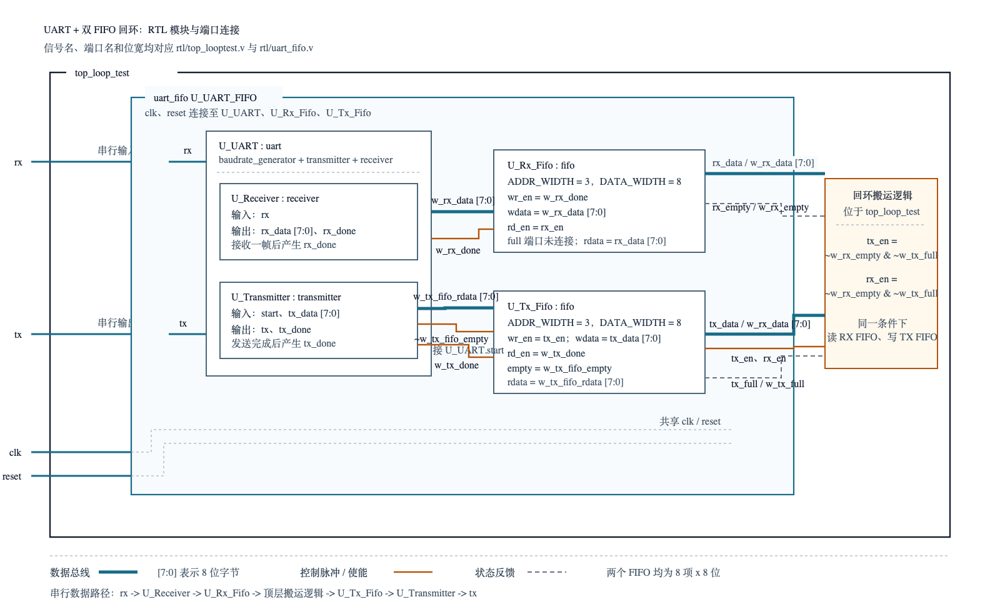

# UART FIFO 模块级验证项目

这是一个基于 Verilog 的 UART + FIFO 回环验证项目。项目不修改原有 RTL 功能，而是在其外部搭建了可重复运行、自检和波形定位的 UVM 模块级验证环境。

原过程式环境的完整回归记录为：26 个 UART 字节检查完成、预期队列无残留、错误数为 0。迁移后的 UVM 环境保持相同场景；请使用支持 UVM 1.2 的仿真器重新执行回归。

## 设计与验证架构



设计数据路径：

```text
UART RX 串行输入
  -> UART 接收器
  -> RX FIFO
  -> 顶层回环搬运逻辑
  -> TX FIFO
  -> UART 发送器
  -> UART TX 串行输出
```

验证数据路径：Driver 将字节编码成 `rx` 串行帧，同时把预期字节写入 Scoreboard 队列；
Monitor 只从 `tx` 端独立解码实际字节；Scoreboard 按顺序比较预期与实际并输出 PASS/FAIL。

## 当前代码结构

| 文件 | 作用 |
| --- | --- |
| `rtl/top_looptest.v` | DUT 顶层；控制 RX FIFO 到 TX FIFO 的数据搬运。 |
| `rtl/uart_fifo.v` | UART 与 RX/TX 双 FIFO 的封装。 |
| `rtl/uart.v` | 波特率发生器、UART 发送器、UART 接收器。 |
| `rtl/fifo.v` | 可复用 FIFO；包含存储阵列与指针/满空控制。 |
| `tb/uvm/tb_top_loop_test_uvm.sv` | UVM 顶层；时钟、DUT、接口绑定、VCD 与 `run_test()` 入口。 |
| `tb/uvm/uart_fifo_if.sv` | UART、FIFO 边界和状态观测 virtual interface。 |
| `tb/uvm/uart_fifo_pkg.sv` | UVM transaction、sequence、agent、scoreboard、checker、env 与 test。 |
| `tb/tb_top_loop_test.v` | 保留的旧过程式 testbench，不再由 `run.sh` 编译。 |
| `tb/driver/`、`tb/monitor/`、`tb/scoreboard.vh`、`tb/test_case.vh` | 保留的 task 版本，供学习对照，不再是默认验证入口。 |

所有实际参与运行的 RTL/TB 文件都已添加中文文件头和逐段注释。系统化学习请从 [RTL 与 TB 初学者指南](doc/rtl_tb_beginner_guide.md) 开始。

UVM 结构、文件职责和工具要求详见 [UVM 迁移说明](doc/changes/02_uvm_migration.md)。

## 测试场景

| 场景 | 命令 | 激励与检查 |
| --- | --- | --- |
| `single` | `./run.sh single` | 单字节 `A5` 端到端回环。 |
| `multi` | `./run.sh multi` | `11 22 33 44` 的数据一致性与顺序。 |
| `stream` | `./run.sh stream` | 20 字节递增序列 `00` 至 `13`。 |
| `fifo` | `./run.sh fifo` | 独立 FIFO 连续写 8 次后的 `full`，读 8 次后的 `empty`。 |
| `reset` | `./run.sh reset` | 复位后重新发送 `A5` 的功能恢复。 |
| `all` | `./run.sh all` | 执行完整回归。 |

`multi` 与 `stream` 使用帧间保护间隔，因此验证的是当前设计覆盖范围内的数据一致性和顺序性，不是 FIFO 灌满后的极限吞吐压力测试。

## 运行仿真

依赖工具：支持 UVM 1.2 的 SystemVerilog 仿真器（VCS、Questa/ModelSim 或 Xcelium）以及可选 GTKWave。Icarus Verilog 不支持标准 UVM 的 class-based 验证环境，不能用于当前入口。

```bash
./run.sh single
./run.sh all
./run.sh multi --wave
```

每次运行会将日志写入 `sim/uart_fifo_sim/log/<场景>.log`。`--wave` 会生成对应 VCD 并打开匹配的 GTKWave 视图；完整回归不导出波形，以避免长时间 VCD 影响运行速度。

GTKWave 场景视图说明见 [gtkwave_views/README.md](gtkwave_views/README.md)。详细测试范围与通过标准见 [验证计划](doc/verification_plan.md)。

## 学习资料

- [RTL 与 TB 初学者指南](doc/rtl_tb_beginner_guide.md)：推荐三小时学习路径、逐文件职责和关键时序。
- `doc/images_cn/`：新增中文架构图、UART 帧图、FIFO 指针图和自检流程图；PNG 可直接预览，SVG 可放大查看。
- `doc/images/`：保留英文原始示意图，不做修改。
- `doc/waveform_causality.md`：将 RTL 行为与波形现象对应起来。
- `doc/steps/`：记录目录整理、testbench 拆分、用例、Scoreboard、检查和运行方式。

## 项目概述

> 基于 Verilog UART/FIFO RTL，完成 UART 收发器、FIFO 缓冲模块及顶层 loopback 数据通路分析，梳理 UART RX -> RX FIFO -> 顶层搬运逻辑 -> TX FIFO -> UART TX 的完整传输链路。在原有 task testbench 基础上，搭建 UVM 模块级自检验证环境：UART agent 的 Driver 和 Monitor 分别完成 `rx` 端激励生成与 `tx` 端采样恢复，Scoreboard 通过 analysis port 对预期与实际事务自动比对。保留单字节回环、多字节顺序、递增序列、FIFO `full/empty` 边界与 reset recovery 场景，并以支持 UVM 1.2 的仿真器执行场景化回归和波形分析。
