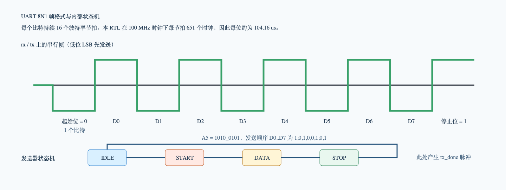
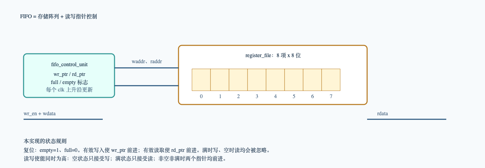
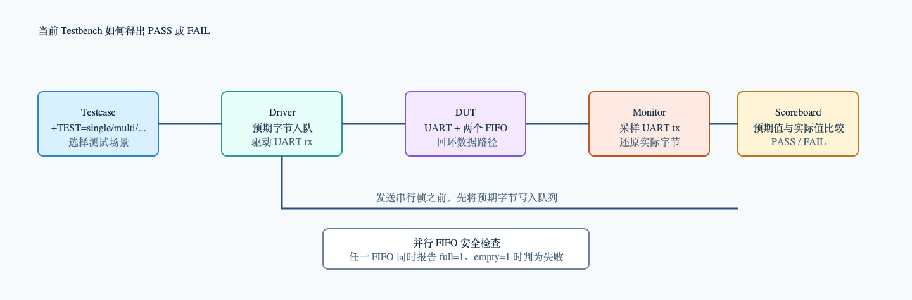

# UART FIFO RTL 与 Testbench 初学者指南

这份文档对应当前真正参与 `run.sh` 编译的 `rtl/` 和 `tb/` 文件。目标是让你先建立全局图，再按“设计 RTL -> 验证 TB -> 波形”顺序读代码。

英文原始示意图仍保留在 `doc/images/`；本次新增的中文图在 `doc/images_cn/`，PNG 可以直接预览，SVG 可以放大查看。


## 先记住这条链路

```text
Driver
  -> rx 串行帧
  -> UART receiver
  -> RX FIFO
  -> top_loop_test 搬运控制
  -> TX FIFO
  -> UART transmitter
  -> tx 串行帧
  -> Monitor
  -> Scoreboard
```

输入的一个字节，例如 `8'hA5`，不会直接从 `rx` 变到 `tx`。它必须先被接收器还原成并行字节，缓存、搬运、再次串行化，然后由 Monitor 重新解码。Scoreboard 最后判断输入顺序和输出顺序是否一致。

## 当前编译文件

| 文件 | 角色 | 你需要抓住的事情 |
| --- | --- | --- |
| `rtl/top_looptest.v` | DUT 顶层 | 用 `~w_rx_empty & ~w_tx_full` 同时控制 RX FIFO 读和 TX FIFO 写。 |
| `rtl/uart_fifo.v` | UART 与双 FIFO 封装 | 收到字节写 RX FIFO；顶层搬到 TX FIFO；发送完成后读 TX FIFO。 |
| `rtl/uart.v` | UART 核 | 由 baudrate_generator、transmitter、receiver 构成。文件前半段是失效的历史注释代码。 |
| `rtl/fifo.v` | 通用 FIFO | `register_file` 存数据；`fifo_control_unit` 管读写指针、`full` 和 `empty`。 |
| `tb/tb_top_loop_test.v` | TB 顶层 | 时钟、DUT、独立 FIFO 边界模型、VCD、运行与汇总入口。 |
| `tb/driver/uart_driver.vh` | Driver | 将字节编码为 UART 8N1 串行帧，并在发送前记录预期值。 |
| `tb/monitor/uart_monitor.vh` | Monitor | 从 `tx` 的起始位开始，按数据位中心采样并还原字节。 |
| `tb/scoreboard.vh` | 自动判定器 | 维护预期环形队列，比较预期字节与实际字节。 |
| `tb/test_case.vh` | 测试场景 | 选择并执行 `single`、`multi`、`stream`、`fifo`、`reset`、`all`。 |
| `tb/uart_task.vh` | 旧版辅助 task | 当前没有被 include；只用于对照新旧 testbench 写法。 |

## 设计 RTL：从顶层向下读

### 1. `rtl/top_looptest.v`

这是 DUT 最顶层，只有一个 `uart_fifo` 实例。最关键的表达式是：

```verilog
~w_rx_empty & ~w_tx_full
```

它同时接到 `rx_en` 和 `tx_en`：

- RX FIFO 不空，才有数据可读。
- TX FIFO 不满，才有空间可写。
- 两个条件同时满足时，同一个时钟沿完成“读 RX FIFO + 写 TX FIFO”的一次搬运。

也就是说，这个文件本身没有存数据，它只决定“什么时候可以将 RX 数据移到 TX”。

### 2. `rtl/uart_fifo.v`

这里有三个实例：`U_UART`、`U_Rx_Fifo`、`U_Tx_Fifo`。

```text
rx -> U_UART receiver -> w_rx_data / w_rx_done -> U_Rx_Fifo
U_Rx_Fifo -> rx_data -> 顶层控制 -> tx_data -> U_Tx_Fifo
U_Tx_Fifo -> w_tx_fifo_rdata -> U_UART transmitter -> tx
```

三条最关键的控制关系：

- `U_Rx_Fifo.wr_en = w_rx_done`：完整 UART 帧接收完成后，才将 `w_rx_data` 写入 RX FIFO。
- `U_Tx_Fifo.wr_en = tx_en`：顶层允许搬运时，将 RX FIFO 当前数据写入 TX FIFO。
- `U_Tx_Fifo.rd_en = w_tx_done`：当前 UART 帧发送完成后，TX FIFO 读指针才前进到下一字节。

注意：TX FIFO 的 `rdata` 是组合读；发送器从 TX FIFO 非空开始发送后，直到 `tx_done` 才使读指针前进。因此一帧串行化期间，发送器看到的数据保持不变。

### 3. `rtl/uart.v`

本文件中，前半段是注释掉的历史实现；从下半部分的 `module uart (` 开始的代码才会参与编译。它分为以下模块：

- `baudrate_generator`：产生 `br_tick`。设计用 100 MHz 时钟，目标 9600 波特率且 16 倍采样，所以约每 651 个 `clk` 产生一个节拍。
- `transmitter`：根据 `IDLE -> START -> DATA -> STOP` 状态机生成 `tx`。
- `receiver`：检测到起始位后，等待半位确认，然后每一位持续 16 个节拍并重建 `rx_data`。



UART 帧格式为 8N1：空闲高电平、起始位低电平、D0 到 D7、停止位高电平。`A5 = 8'b1010_0101` 的数据位发送次序是 D0 到 D7：`1, 0, 1, 0, 0, 1, 0, 1`。

接收器中两级寄存器 `rx_sync1_reg`、`rx_sync2_reg` 的作用是同步外部异步输入 `rx`，降低亚稳态继续传播到状态机的风险。

### 4. `rtl/fifo.v`

这个文件有三个模块：

- `fifo`：接口外壳，将存储体和控制器连起来。
- `register_file`：`mem[0:7]` 存储阵列。有效写在 `posedge clk` 执行；读数据 `rdata` 由 `mem[raddr]` 组合输出。
- `fifo_control_unit`：保存 `wr_ptr`、`rd_ptr`、`full`、`empty`，根据读写请求计算下一拍状态。



本 FIFO 用同样 3 位的 `wr_ptr`、`rd_ptr` 判断状态。两个指针数值相等时，必须依赖已保存的 `full/empty` 标志区分“全空”和“全满”。本实现中：

- 复位后：`empty=1`、`full=0`。
- 有效写入后：写指针前进，`empty` 清零。
- 有效读取后：读指针前进，`full` 清零。
- 写指针下一值追上读指针：`full=1`。
- 读指针下一值追上写指针：`empty=1`。
- `wr_en`、`rd_en` 同时为 1 时，空 FIFO 只接受写，满 FIFO 只接受读；其余情况下读写都前进。

## 验证 TB：从测试到自动判定



### 1. `tb/tb_top_loop_test.v`

TB 顶层完成四件事：

- 每 `5 ns` 翻转一次 `clk`，形成 `100 MHz` 时钟。
- 实例化 `top_loop_test dut`。
- 实例化独立的 `fifo_boundary_model`，直接测试 `fifo.v` 的满/空边界。
- include 验证组件，依次执行 `scoreboard_reset()`、复位、选中 testcase、汇总报告。

可选传入 `+VCD=<路径>`，它会用 `$dumpvars` 导出 `rx`、`tx`、`driver_data`、`monitor_data`、FIFO 状态和完成脉冲，用 GTKWave 观察。

### 2. Driver 与 Monitor 的时间关系

Driver 中 `uart_driver_send_byte(8'hA5)` 做了：

```text
1. Scoreboard 记录 expected=A5
2. rx 保持高电平一个 bit 时间
3. rx 拉低一个 bit 时间，作为起始位
4. 依次驱动 data[0] 到 data[7]，每位一个 bit 时间
5. rx 拉高一个 bit 时间，作为停止位
```

Monitor 并不“知道”Driver 发送了什么。它只看 DUT 的 `tx`：

```text
1. 等待 tx 的下降沿，即起始位开始
2. 等待 1.5 个 bit 时间，抵达 D0 中心
3. 每隔一个 bit 时间采样一次，共采样 D0 到 D7
4. 将结果交给 Scoreboard
```

这种分离很重要：如果 Monitor 也直接读取 Driver 的变量，就不能证明 DUT 的串行输出真的正确。

### 3. `tb/scoreboard.vh`

预期队列是一个深度 256 的环形数组：

```text
Driver:  expected_queue[write_index] <- data
Monitor: actual 与 expected_queue[read_index] 比较
```

它能自动发现四类问题：数据不相等、顺序错误、没有预期却收到输出、仿真结束仍有预期未收到。比较中使用 `!==`，因此 `X` 或 `Z` 也会导致失败。

### 4. `tb/test_case.vh`

| 场景 | 指令 | 主要检查 |
| --- | --- | --- |
| 单字节 | `./run.sh single` | `A5` 基础回环 |
| 多字节 | `./run.sh multi` | `11 22 33 44` 的数据与顺序 |
| 递增序列 | `./run.sh stream` | `00` 至 `13` 共 20 字节的连续顺序 |
| FIFO 边界 | `./run.sh fifo` | 独立 FIFO 写 8 次后 `full`，读 8 次后 `empty` |
| 复位恢复 | `./run.sh reset` | 复位后发送 `A5` 仍能回环 |
| 完整回归 | `./run.sh all` | 依次运行所有上述场景 |

`multi` 和 `stream` 使用 `run_safe_loopback_sequence()`：每一帧 Driver 与 Monitor 并行，但一帧结束后留出保护间隔。它证明当前覆盖范围内的数据一致性和顺序性；不要把它描述为 FIFO 极限压力测试。

## 三小时学习路线

### 第 1 小时：先跑通一个 A5

1. 打开 `doc/images_cn/uart_fifo_loopback_architecture.png`，按箭头说出数据经过的模块。
2. 阅读 `rtl/top_looptest.v`、`rtl/uart_fifo.v`，只追踪 `A5` 如何从 RX FIFO 移到 TX FIFO。
3. 运行 `./run.sh single`；确认日志里有一次 `[SCB][PASS]` 和最终 `TEST PASS`。
4. 运行 `./run.sh single --wave`，在 GTKWave 看 `driver_data`、`rx`、`w_rx_done`、`rx_data`、`tx`、`monitor_data`。

### 第 2 小时：吃透 UART 与 FIFO

1. 对照 `uart_frame_and_states.png` 阅读 `rtl/uart.v` 的 transmitter 和 receiver。
2. 对照 `fifo_pointer_model.png` 阅读 `rtl/fifo.v`，手画“复位 -> 写 8 次 -> full -> 读 8 次 -> empty”的指针变化。
3. 运行 `./run.sh fifo --wave`，确认第 8 次写后 `full=1`，第 8 次读后 `empty=1`。

### 第 3 小时：吃透验证闭环

面试导向的完整讲解、错序示例、用例边界和高频问答见 [验证闭环与面试准备](verification_interview_guide.md)。

1. 对照 `verification_self_checking_flow.png` 阅读 Driver、Monitor 和 Scoreboard。
2. 运行 `./run.sh multi`，明确为什么 Scoreboard 能发现错序。
3. 阅读 `tb/test_case.vh`，说清每个 `+TEST` 场景在验证什么、没验证什么。
4. 最后运行 `./run.sh all`；通过标准是错误数为 0 且没有待匹配预期数据。

## 面试时的一分钟讲法

> 这个项目的 DUT 是 UART 加双 FIFO 的回环通路。串行输入先由 UART 接收器还原为字节并写入 RX FIFO，顶层在 RX FIFO 非空且 TX FIFO 未满时将数据搬运到 TX FIFO，UART 发送器再把字节串行化输出。我在外部搭建了 Verilog 自检环境：Driver 产生 UART 激励并记录预期数据，Monitor 从 TX 端独立解码实际数据，Scoreboard 用队列逐项比较。用例覆盖基础回环、顺序多字节、递增序列、独立 FIFO 满空边界和复位恢复；通过 Icarus Verilog 回归和 GTKWave 波形定位问题。
